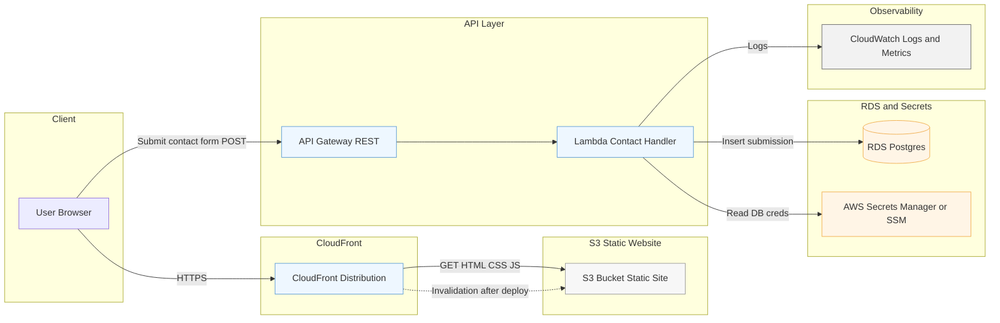
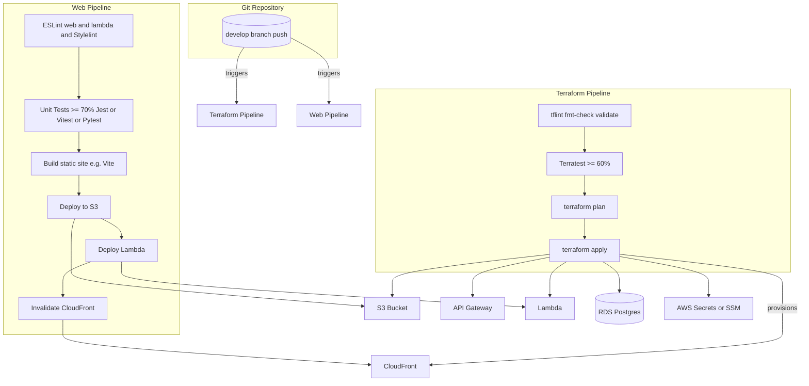

## Architecture Diagram

```mermaid
flowchart LR
  subgraph Client
    U[User Browser]
  end

  subgraph CDN[CloudFront]
    CF[CloudFront Distribution]
  end

  subgraph Storage[S3 Static Website]
    S3[S3 Bucket Static Site]
  end

  subgraph API[API Layer]
    APIGW[API Gateway REST]
    LAMBDA[Lambda Contact Handler]
  end

  subgraph Data[RDS and Secrets]
    RDS[(RDS Postgres)]
    SECRETS[AWS Secrets Manager or SSM]
  end

  subgraph Observability
    CW[CloudWatch Logs and Metrics]
  end

  U -->|HTTPS| CF
  CF -->|GET HTML CSS JS| S3
  U -->|Submit contact form POST| APIGW

  APIGW --> LAMBDA
  LAMBDA -->|Read DB creds| SECRETS
  LAMBDA -->|Insert submission| RDS
  LAMBDA -->|Logs| CW

  CF -. Invalidation after deploy .-> S3

  classDef storage fill:#f7f7f7,stroke:#999,stroke-width:1px;
  classDef service fill:#eef7ff,stroke:#5b9bd5,stroke-width:1px;
  classDef data fill:#fff5e6,stroke:#f0ad4e,stroke-width:1px;
  classDef obs fill:#f2f2f2,stroke:#666,stroke-width:1px;

  class S3 storage
  class CF,APIGW,LAMBDA service
  class RDS,SECRETS data
  class CW obs
```

## CI/CD Pipelines Diagram

```mermaid
flowchart TB
  subgraph Repo[Git Repository]
    DEV[(develop branch push)]
  end

  DEV -->|triggers| TFPIPE[Terraform Pipeline]
  DEV -->|triggers| WEBPIPE[Web Pipeline]

  subgraph TFPIPEDETAILS[Terraform Pipeline]
    TFLINT[tflint fmt-check validate]
    TERRATEST[Terratest >= 60%]
    PLAN[terraform plan]
    APPLY[terraform apply]

    TFLINT --> TERRATEST --> PLAN --> APPLY
  end

  subgraph WEBPIPEDETAILS[Web Pipeline]
    FLINT[ESLint web and lambda and Stylelint]
    FTEST[Unit Tests >= 70% Jest or Vitest or Pytest]
    BUILD[Build static site e.g. Vite]
    DEPLOY_S3[Deploy to S3]
    DEPLOY_LAMBDA[Deploy Lambda]
    INVALIDATE[Invalidate CloudFront]

    FLINT --> FTEST --> BUILD --> DEPLOY_S3 --> DEPLOY_LAMBDA --> INVALIDATE
  end

  APPLY -->|provisions| CF[CloudFront]
  APPLY --> S3[S3 Bucket]
  APPLY --> APIGW[API Gateway]
  APPLY --> LAMBDA_RES[Lambda]
  APPLY --> RDS[(RDS Postgres)]
  APPLY --> SECRETS[AWS Secrets or SSM]

  DEPLOY_S3 --> S3
  DEPLOY_LAMBDA --> LAMBDA_RES
  INVALIDATE --> CF
```
